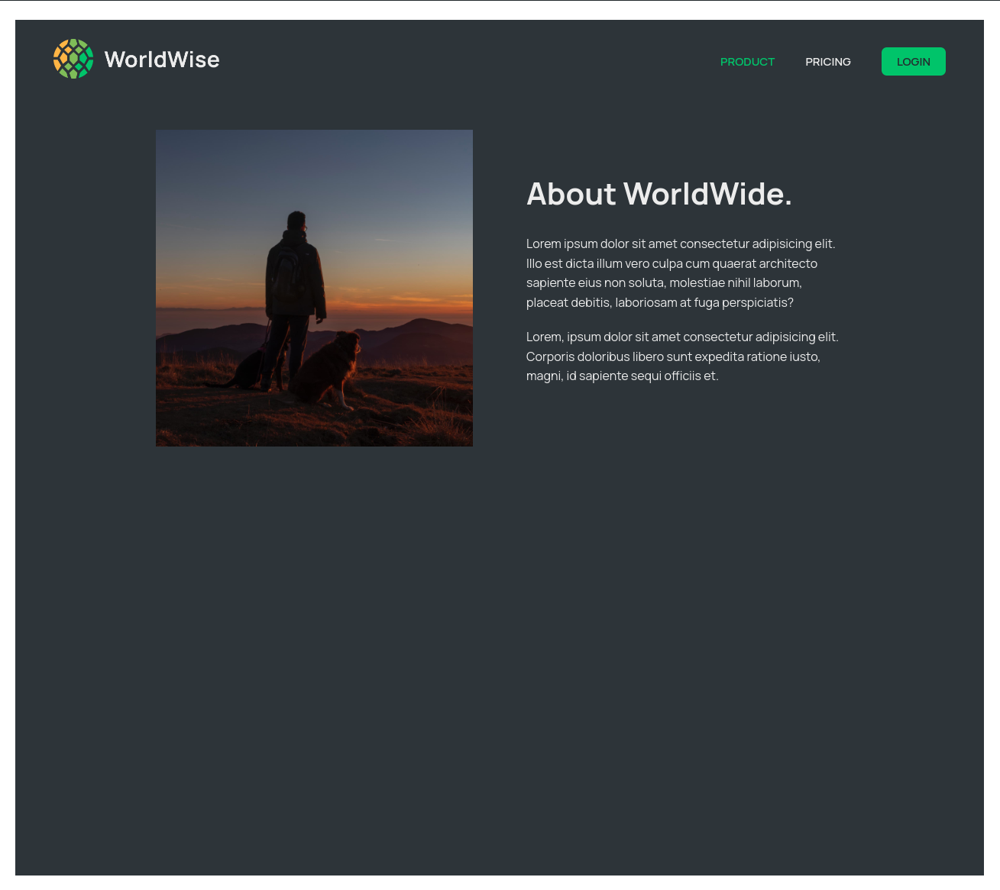
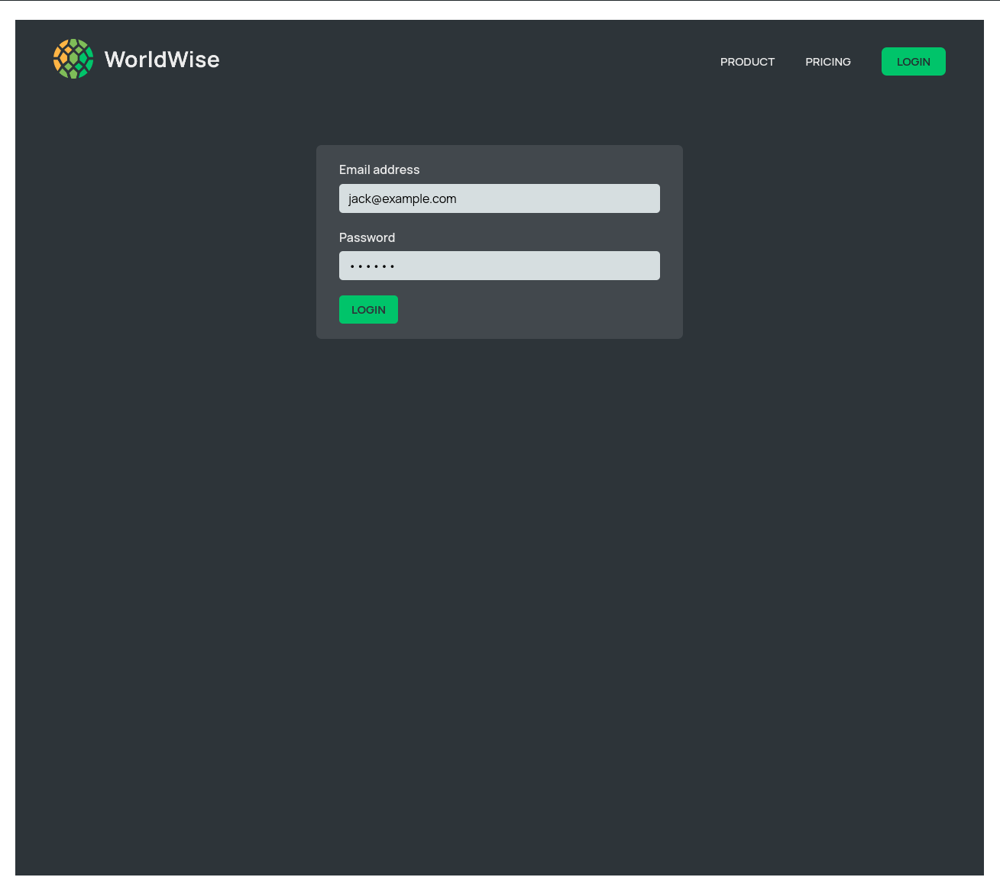
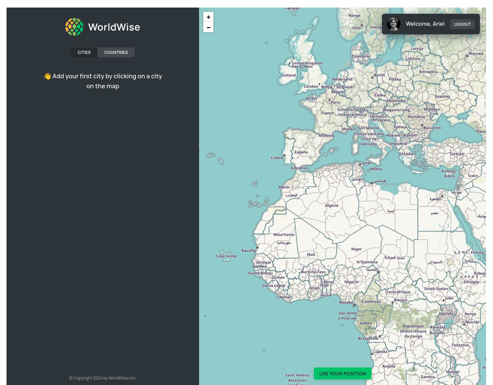
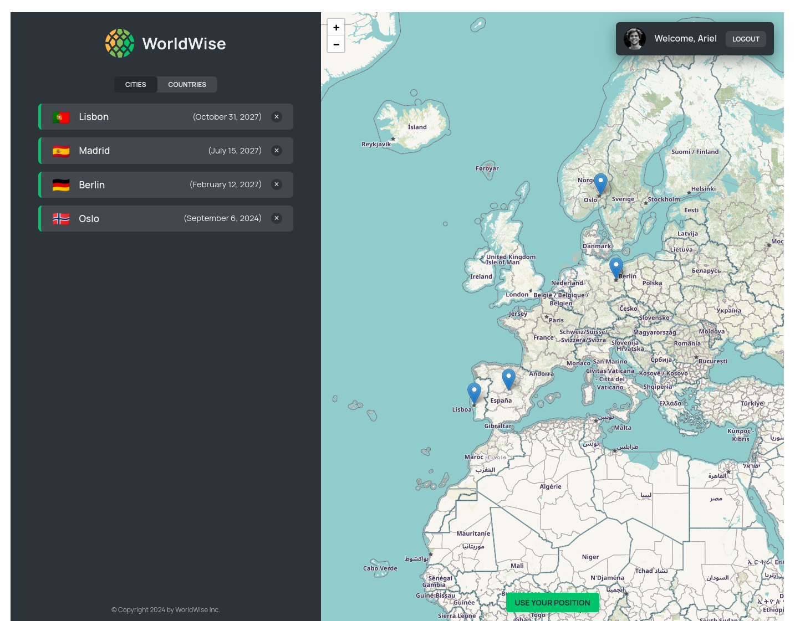
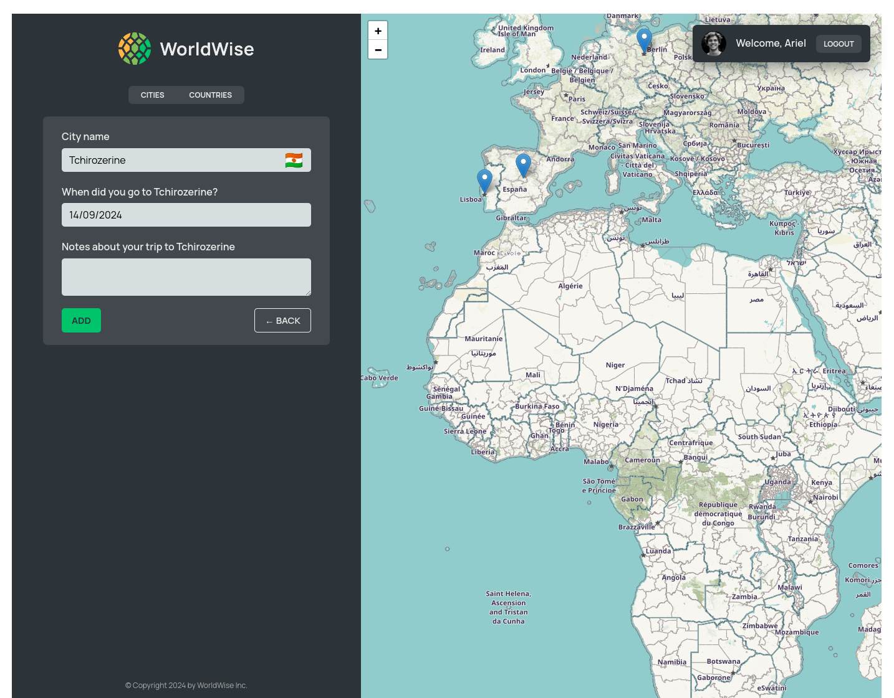
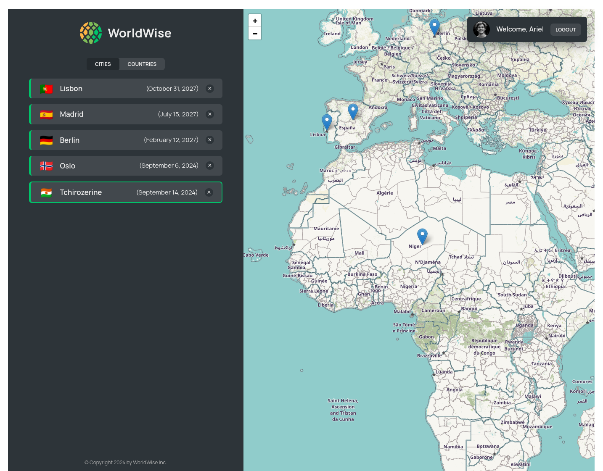
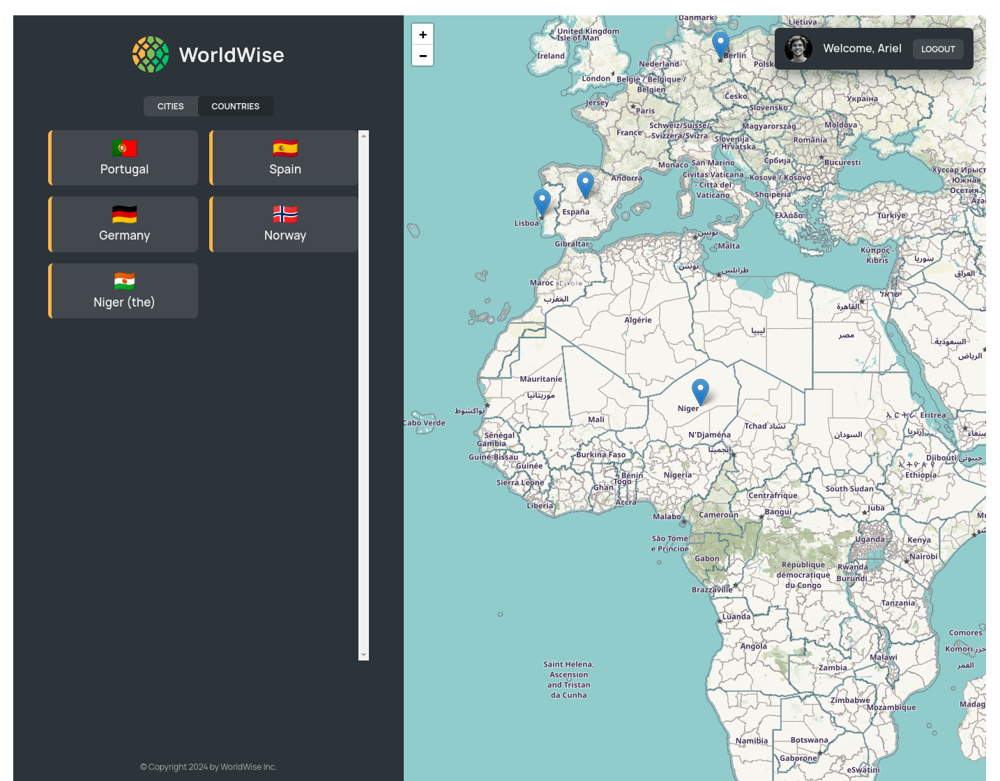

# World Wise

## What it's about?

WorlWise is a Single Page Application (SPA) which let you track your travels into different cities and countries.
You can mark a position on a map and create new entry into your data api where the all travel locations are safely kept.
You can filter to see all countries you've been to. You can delete cities as you wish.
Every city is added with a date you've choosen to help you monitor you travels over time.

### Some technical details if you're interested :)

I keep location data in a cities.json file which I use as a public API using json-server.
When I click in a City I add it to this file and when I delete it then the entry is removed.

Every new location looks like this
:arrow_down:

```json
{
  "cities": [
    {
      "cityName": "Lisbon",
      "country": "Portugal",
      "emoji": "🇵🇹",
      "date": "2027-10-31T15:59:59.138Z",
      "notes": "My favorite city so far!",
      "position": {
        "lat": 38.727881642324164,
        "lng": -9.140900099907554
      },
      "id": "73930385"
    },
```

## Technologies

- react with javascript
- react router for page navigation
- react leaflet for map display and picking position actions
- css modules for styling

## How is it look?

### Main page


### Static view Product site



### Login Page



### Start tracking welcome page



### Default cities saved into api



### Add new city to your list



### New city added - it has a green border



### Countries you've visited



## How to run

```
cd word-wise
npm run server
npm run dev
```
